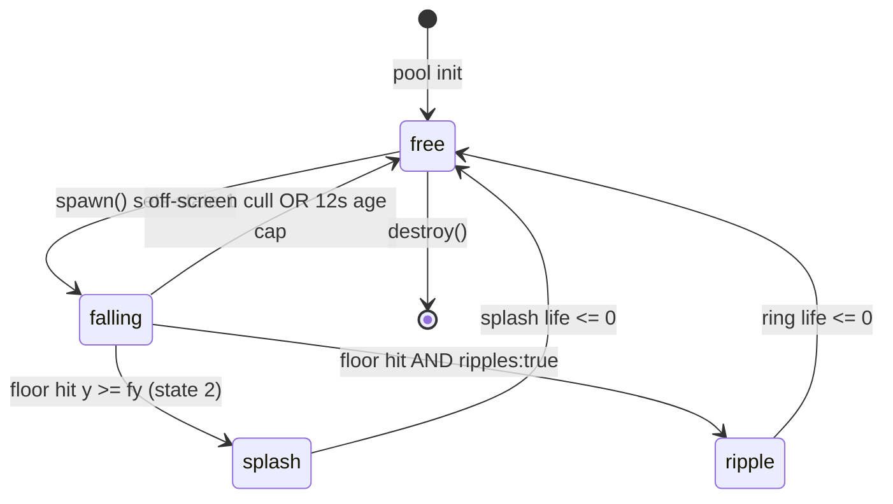

# @zakkster/lite-rain

> Zero-GC, structure-of-arrays environmental rain engine. Z-depth parallax, streak-to-splash metamorphosis, bucketed one-stroke-per-tier rendering, wind gusts, ground ripples, and depth-scaled terminal velocity. Built for game overlays and long-running weather scenes that must hold 60fps with no GC pauses.

[](https://www.npmjs.com/package/@zakkster/lite-rain)
[](https://github.com/sponsors/PeshoVurtoleta)
[](https://bundlephobia.com/result?p=@zakkster/lite-rain)
[](https://www.npmjs.com/package/@zakkster/lite-rain)
[](https://www.npmjs.com/package/@zakkster/lite-rain)


[](https://opensource.org/licenses/MIT)

## The rain engine the ecosystem was missing

`lite-rain` is the weather-facing end of the `@zakkster` real-time canvas stack. `lite-fireworks` owns bursts, `lite-sparks` owns impacts, `lite-snow` owns drift, `lite-confetti` owns celebration. Nothing between them produced falling rain that a game loop can composite on top of a scene at 60fps without allocating a particle object per drop and paying for it in GC jitter. Rain is that piece: one pre-allocated structure-of-arrays pool, three batched stroke calls for every streak on screen, and zero allocations on the frame path once the pool is built.

```bash
npm i @zakkster/lite-rain
```

One runtime dependency (`@zakkster/lite-color`, for the OKLCH color string), installed automatically.

```js
import { RainEngine } from '@zakkster/lite-rain';

const canvas = document.getElementById('stage');
const ctx = canvas.getContext('2d');
const rain = new RainEngine(8000);          // pool capacity, pre-allocated once

let w = canvas.width, h = canvas.height;
let last = performance.now();

function loop(time) {
    const dt = Math.min((time - last) / 1000, 0.1);
    last = time;

    rain.spawn(dt, w, h);                    // 1. spawn new drops (area x density)
    ctx.clearRect(0, 0, w, h);               // 2. clear -- CALLER's job, not the engine's
    // drawScene(ctx);                        // 3. draw your scene underneath
    rain.updateAndDraw(ctx, dt, w, h);       // 4. rain overlays on top

    requestAnimationFrame(loop);
}
requestAnimationFrame(loop);
```

`updateAndDraw()` does not clear the canvas. Rain is an overlay: it renders on top of whatever you drew that frame. Clear and paint your scene first, then let the rain fall over it.

---

## Table of contents

- [Why this exists](#why-this-exists)
- [What you get](#what-you-get)
- [The SoA pool and the streak/splash lifecycle](#the-soa-pool-and-the-streaksplash-lifecycle)
- [API reference](#api-reference)
  - [Constructor](#constructor)
  - [Methods](#methods)
  - [Config constants](#config-constants)
  - [RAIN_PRESETS](#rain_presets)
- [Composability](#composability)
- [Zero-GC design notes](#zero-gc-design-notes)
- [Design decisions worth knowing](#design-decisions-worth-knowing)
- [Testing](#testing)
- [What this is not](#what-this-is-not)
- [Ecosystem](#ecosystem)
- [License](#license)

---

## Why this exists

Falling rain over a live scene has two problems no small library solves at once:

1. **A GC pause is a dropped frame.** A weather overlay runs for the whole life of a game or a screensaver -- minutes, hours. Allocate a `{x, y, vx, vy}` object per drop and you churn thousands of short-lived objects per second; the major GC that eventually reclaims them lands as a visible hitch. Rain never allocates a drop. Every particle is a lane index into twelve pre-allocated typed arrays, recycled in place. The frame path measures at ~0.11 bytes per op under the torture harness -- effectively nothing.

2. **Depth sells the effect, and depth is expensive if you pay per frame.** Convincing rain needs parallax: near drops fall fast, wide, and bright; far drops are slow, thin, and faint. Compute that per drop per frame and the render loop drowns in multiplies. Rain precomputes every depth-scaled quantity (`gravity*z`, `wind*z`, `blur*z`, the depth bucket) once at spawn, so the render loop does no multiplication for them -- it reads a lane and strokes.

Existing options: a general particle library (heavyweight, object-per-particle, GC-bound), a hand-rolled canvas loop (drifts, leaks the pool the first time a drop is trapped off-screen), or a full engine (megabytes for one effect). Rain is a single file for this one job, and it is fail-closed: a non-finite config value throws at construction naming the key, never poisons the pool at frame 1.

---

## What you get

- **`RainEngine`** -- one stateful class that owns the whole particle pool and exposes the frame loop. Build it once per `(maxParticles, config)`; call `spawn` then `updateAndDraw` every frame.
  - **`spawn(dt, w, h)`** -- births new drops. Count auto-scales with canvas area x `density` x frame time. A ring cursor makes low-occupancy spawn O(spawned), not O(pool).
  - **`updateAndDraw(ctx, dt, w, h)`** -- one physics pass that bins each live drop into its render list as it resolves, then a bucketed render that walks only the live indices. Does not clear the canvas.
  - **`clear()` / `destroy()`** -- kill all particles, or null every backing array and release the pool.
  - **`liveCount()`** -- O(pool) live-particle count; test/debug telemetry for the conservation invariant, not a hot path.
- **`VERSION`, `MAX_PARTICLES`** -- the version string and the documented pool ceiling (`2000000`; the constructor throws above it).
- **`RAIN_PRESETS`** -- four frozen partial configs (`drizzle`, `steady`, `downpour`, `storm`) that spread straight into the constructor and pass the finite-config door.
- **Z-depth parallax** -- every physics and render quantity scales by a per-drop depth in `[0.2, 1.0]`, precomputed at spawn.
- **Streak-to-splash metamorphosis** -- a falling streak that reaches the floor becomes a splash particle with an impact-scaled radius, a bounce, and a short fade.
- **Environment knobs** -- live wind `gust` oscillation, a settable splash `floorY`, extra impact `splashDroplets`, and expanding ground `ripples`.

Full types ship in [`RainEngine.d.ts`](./RainEngine.d.ts). Every option is documented.

---

## The SoA pool and the streak/splash lifecycle

<details>
<summary>How one pool of twelve typed arrays becomes rain -- the data layout and the two-state machine.</summary>

### The structure-of-arrays pool

A particle is not an object. It is an index `i` shared across twelve parallel arrays allocated once at construction, sized to `maxParticles`:

| Array       | Type           | Holds                                                     |
| ----------- | -------------- | -------------------------------------------------------- |
| `x`, `y`    | `Float32Array` | Position.                                                |
| `vx`, `vy`  | `Float32Array` | Velocity.                                                |
| `z`         | `Float32Array` | Depth in `[0.2, 1.0]`; the parallax driver.              |
| `gz`        | `Float32Array` | `gravity * z`, precomputed at spawn.                     |
| `wz`        | `Float32Array` | `wind * z`, precomputed at spawn.                        |
| `tailMult`  | `Float32Array` | `blurStrength * z`, the streak-length multiplier.        |
| `bucket`    | `Uint8Array`   | Depth tier `0/1/2`, chosen at spawn.                     |
| `radius`    | `Float32Array` | Splash radius (written at the floor hit).                |
| `life`      | `Float32Array` | Time-aloft budget while falling; splash lifetime after.  |
| `state`     | `Uint8Array`   | `0` free, `1` falling (streak), `2` splash.              |

The `state` array is the allocator: `0` means the lane is free to reuse. There is no free list and no object churn -- births flip a `0` lane to `1`, deaths flip any lane back to `0`.

### The lifecycle

Each lane walks a small state machine. Freshly spawned drops fall (state 1); a drop that reaches the floor turns into a splash (state 2); a drop that leaves the simulable region, or that has been aloft past the 12s age cap, is recycled straight back to free. When ripples are enabled, each floor hit also pushes an expanding ring into a separate 64-slot ring buffer that ages independently of the pool.



### One physics pass, then a bucketed render

`updateAndDraw` scans the pool exactly once. For each live drop it integrates the step, resolves the transition (floor hit, cull, age-out), and -- keyed on the FINAL state that frame -- appends the lane index into one of three persistent streak lists (by depth bucket) or the splash list. A drop that died this frame is state 0 and is binned nowhere, so it is never drawn.

The render then walks ONLY those binned indices. All streaks in a depth tier share one `globalAlpha` and one `lineWidth`, so each tier is a single `beginPath()` ... `stroke()` -- three stroke calls for every streak on screen, not one per drop:

| Bucket   | Z range     | Opacity | Line width |
| -------- | ----------- | ------- | ---------- |
| 0 (far)  | 0.2 - 0.4   | 0.18    | 0.6 px     |
| 1 (mid)  | 0.4 - 0.7   | 0.33    | 1.1 px     |
| 2 (near) | 0.7 - 1.0   | 0.54    | 1.8 px     |

Splashes render after, as filled arcs with depth-modulated alpha; ground ripples last, all live rings in one stroke. The streak index buffers, the splash index buffer, and the ripple ring are allocated once and never grow.

</details>

---

## API reference

### Constructor

```ts
new RainEngine(maxParticles?: number, config?: RainConfig)
```

- **`maxParticles`** -- pool capacity, an integer in `[1, MAX_PARTICLES]` (`MAX_PARTICLES = 2000000`). Default `8000`. Anything else -- `0`, `2.5`, `-1`, over the ceiling -- throws a `RangeError`.
- **`config`** -- see [Config constants](#config-constants). Every numeric force key must be finite (and `angle` finite when non-null); a non-finite value throws a `RangeError` naming the offending key. `splashDroplets` must be an integer in `[0, 3]`; `ripples` must be a strict boolean; `floorY` must be finite or `null`.

The constructor allocates every array it will ever use and validates the whole config up front, so the frame path never branches on a bad state. Rebuild the engine to retune -- see [Design decisions](#design-decisions-worth-knowing).

### Methods

```ts
rain.spawn(dt, w, h): void            // birth new drops; count = area x density x dt
rain.updateAndDraw(ctx, dt, w, h): void  // physics + render; does NOT clear the canvas
rain.liveCount(): number              // O(pool) count of live lanes (state != 0); telemetry
rain.clear(): void                    // kill all particles immediately
rain.destroy(): void                  // null every backing array; idempotent
```

- **`dt`** -- delta time in seconds. A `dt <= 0`, or a non-finite `dt`, is a no-op step (never a reversed or poisoned integrator); `dt > 0.1` clamps to `0.1`.
- **`w`, `h`** -- logical canvas width and height. A non-finite or non-positive `w`/`h` is a no-op. `h` is the splash floor unless `config.floorY` overrides it.
- **`ctx`** -- a Canvas 2D context. `updateAndDraw` sets `strokeStyle`/`fillStyle`/`globalAlpha`/`lineWidth`/`lineCap` itself and restores `globalAlpha` to `1.0` on exit.

Call `spawn` then `updateAndDraw` once each per frame. Both are no-ops after `destroy()`.

### Config constants

Every key, its default, and what it does. Defaults live in the constructor; a non-finite numeric value throws at construction.

| Key              | Default                    | Meaning                                                                    |
| ---------------- | -------------------------- | -------------------------------------------------------------------------- |
| `gravity`        | `1500`                     | Downward acceleration, px/s^2. Rain is heavy.                              |
| `wind`           | `200`                      | Horizontal wind, px/s. Positive = right, negative = left.                  |
| `density`        | `5.0`                      | Spawn-rate multiplier. Scales with canvas area automatically.              |
| `maxSpeed`       | `2500`                     | Terminal velocity cap, px/s. Depth-scaled per drop (`maxSpeed * z`).       |
| `blurStrength`   | `0.04`                     | Velocity-direction streak-length multiplier. Higher = longer streaks.     |
| `splashBounce`   | `0.25`                     | Splash bounce energy retention, 0 - 1.                                     |
| `splashSpread`   | `200`                      | Splash horizontal spread, px.                                              |
| `splashLifeMin`  | `0.1`                      | Minimum splash lifetime, seconds.                                          |
| `splashLifeMax`  | `0.3`                      | Maximum splash lifetime, seconds.                                          |
| `splashScale`    | `1.2`                      | Splash base radius scalar: `radius = z * (splashScale + abs(vy)/2000)`.    |
| `angle`          | `null`                     | Fixed rain angle, radians. `null` = natural gravity + wind.                |
| `gust`           | `0`                        | Wind-gust amplitude, px/s per step. `0` = off.                             |
| `gustRate`       | `fround(2*PI/3)` (~3s)     | Gust oscillator frequency, rad/s. `~3s` swell period at the default.       |
| `floorY`         | `null`                     | Splash floor Y, px. `null` = use the frame height `h`.                     |
| `splashDroplets` | `0`                        | Extra droplets emitted per impact. Integer in `[0, 3]`.                    |
| `ripples`        | `false`                    | Draw expanding ground ripple rings at each impact. Strict boolean.         |
| `color`          | `'oklch(0.95 0.05 250)'`   | Rain color: an OKLCH `{l, c, h}` object or a CSS string. Parsed once.      |
| `rng`            | `Math.random`              | RNG `() => number` in `[0, 1)`. Inject a seeded RNG for deterministic rain.|

`VERSION` (string) and `MAX_PARTICLES` (`2000000`) are named exports.

### RAIN_PRESETS

A frozen object of four partial configs. Each nested config is also frozen, so a preset cannot be mutated in place. Spread one into the constructor: `new RainEngine(8000, { ...RAIN_PRESETS.storm })`. Keys not listed fall back to the defaults above.

| Preset     | Config                                                                             |
| ---------- | ---------------------------------------------------------------------------------- |
| `drizzle`  | `{ gravity: 900, wind: 80, density: 2, maxSpeed: 1500 }`                            |
| `steady`   | `{ gravity: 1500, wind: 200, density: 5 }`                                          |
| `downpour` | `{ gravity: 2000, wind: 350, density: 14, splashSpread: 260 }`                      |
| `storm`    | `{ gravity: 2200, wind: 1200, angle: 0.4, gust: 300, density: 22, splashSpread: 320 }` |

`storm` is the showcase: high wind, a fixed slanted `angle`, and a live wind `gust`. Every value is finite and passes the constructor door.

---

## Composability

Rain is an overlay. It shares the `(ctx, dt, w, h)` frame contract with the rest of the `@zakkster` canvas stack, so any number of engines composite into one loop -- clear once, draw each layer in order.

### A full game loop

```js
import { RainEngine, RAIN_PRESETS } from '@zakkster/lite-rain';

const canvas = document.getElementById('stage');
const ctx = canvas.getContext('2d');
const rain = new RainEngine(12000, { ...RAIN_PRESETS.storm, ripples: true, splashDroplets: 2 });

// Cache dimensions; recompute only on a debounced resize (see below), never in the loop.
let w = canvas.width, h = canvas.height, last = performance.now();

function loop(time) {
    const dt = Math.min((time - last) / 1000, 0.1);
    last = time;

    rain.spawn(dt, w, h);            // 1. birth drops

    ctx.clearRect(0, 0, w, h);       // 2. clear (caller owns this)
    drawSky(ctx, w, h);              // 3. your scene, back to front
    drawTerrain(ctx, w, h);
    drawCharacters(ctx, w, h);

    rain.updateAndDraw(ctx, dt, w, h); // 4. rain over everything
    drawHUD(ctx, w, h);              // 5. UI on top of the weather, if you like

    requestAnimationFrame(loop);
}
requestAnimationFrame(loop);
```

### Co-rendering rain with snow or confetti

Every engine reads the same `(ctx, dt, w, h)`, so layering weather is just calling them in order between the clear and the present:

```js
import { RainEngine }  from '@zakkster/lite-rain';
import { SnowEngine }  from '@zakkster/lite-snow';
import { ConfettiEngine } from '@zakkster/lite-confetti';

const rain     = new RainEngine(8000, { color: { l: 0.85, c: 0.03, h: 220 } });
const snow     = new SnowEngine(4000);
const confetti = new ConfettiEngine(3000);

function loop(time) {
    const dt = frameDelta(time);

    rain.spawn(dt, w, h);
    snow.spawn(dt, w, h);

    ctx.clearRect(0, 0, w, h);
    drawScene(ctx, w, h);

    snow.updateAndDraw(ctx, dt, w, h);      // drift behind the rain
    rain.updateAndDraw(ctx, dt, w, h);      // rain in front
    confetti.updateAndDraw(ctx, dt, w, h);  // a burst on top, on demand

    requestAnimationFrame(loop);
}
```

Each engine owns its own pool; none allocates on the frame path; the order of the `updateAndDraw` calls is the paint order.

### Off the main thread: Worker + OffscreenCanvas

Rain is pure compute over a 2D context, so it moves cleanly into a Worker driving an `OffscreenCanvas`. The main thread transfers the canvas once and forwards resize events; the Worker owns the loop and never touches the DOM.

```html
<!-- page -->
<canvas id="stage"></canvas>
<script type="module">
  const canvas = document.getElementById('stage');
  const offscreen = canvas.transferControlToOffscreen();
  const worker = new Worker('./rain-worker.js', { type: 'module' });

  // Hand the canvas to the Worker once, transferred (not copied).
  worker.postMessage({ type: 'init', canvas: offscreen,
                       w: canvas.clientWidth, h: canvas.clientHeight }, [offscreen]);

  // Forward resize; the loop lives in the Worker, so no layout read happens per frame.
  let queued = false;
  addEventListener('resize', () => {
    if (queued) return;
    queued = true;
    requestAnimationFrame(() => {
      queued = false;
      worker.postMessage({ type: 'resize', w: canvas.clientWidth, h: canvas.clientHeight });
    });
  });
</script>
```

```js
// rain-worker.js
import { RainEngine, RAIN_PRESETS } from '@zakkster/lite-rain';

let ctx, rain, w = 0, h = 0, last = 0, running = false;

onmessage = (e) => {
  const m = e.data;
  if (m.type === 'init') {
    ctx = m.canvas.getContext('2d');
    m.canvas.width = w = m.w;
    m.canvas.height = h = m.h;
    rain = new RainEngine(12000, { ...RAIN_PRESETS.downpour });
    last = performance.now();
    running = true;
    requestAnimationFrame(loop);      // Workers get their own rAF via OffscreenCanvas
  } else if (m.type === 'resize' && ctx) {
    w = m.w; h = m.h;
    ctx.canvas.width = w;             // sizing the OffscreenCanvas is a Worker-side write
    ctx.canvas.height = h;
  }
};

function loop(time) {
  if (!running) return;
  const dt = Math.min((time - last) / 1000, 0.1);
  last = time;

  rain.spawn(dt, w, h);
  ctx.clearRect(0, 0, w, h);
  rain.updateAndDraw(ctx, dt, w, h);

  requestAnimationFrame(loop);
}
```

The main thread never reads layout in a loop and never blocks on the physics; the Worker never reads the DOM. The canvas is transferred once, and every frame after is Worker-local.

---

## Zero-GC design notes

<details>
<summary>What the frame path allocates (nothing), and the numbers that prove it.</summary>

The constructor allocates the whole working set: twelve SoA arrays sized to `maxParticles`, three persistent streak-index `Uint32Array`s and a splash-index `Uint32Array` (all sized to the pool, never grown), and -- only when `ripples:true` -- a 64-slot Float32 ripple ring. Everything after that is integer and float arithmetic on those arrays plus canvas draw calls.

| Operation                         | Steady-state allocations |
| --------------------------------- | ------------------------ |
| `spawn` (ring-cursor births)      | **0**                    |
| `updateAndDraw` physics pass      | **0**                    |
| `updateAndDraw` bucketed render   | **0**                    |
| ripple ring (feature on)          | **0** (fixed 64-slot ring, aged in place) |
| `new RainEngine(...)`             | once, at construction (all arrays, then reused) |

The one cold branch is the finite-config door: it re-validates only when the constructor runs, and throws (allocating an error) only on a bad value -- never in steady state. The OFF path (`gust:0`, `splashDroplets:0`, `ripples:false`, `floorY:null`) carries no ripple buffers at all and is byte-identical to the pre-gust engine.

### Torture harness (gated)

`node --expose-gc test/torture.mjs` runs the pool through leak and GC gates (`@zakkster/lite-leak` + `@zakkster/lite-gc-profiler`). Committed numbers for the current engine:

| Metric                    | Value        |
| ------------------------- | ------------ |
| Allocation (frame path)   | ~0.11 B/op   |
| Major GCs                 | 0            |
| Max GC pause              | 0.00 ms      |
| Leak findings             | 0            |

A regression that starts allocating on the frame path fails this gate as loudly as a leak would; no gate output is treated as a FAIL.

### Frame-time bench (provenance)

`npm run bench` (`bench/bench.mjs`) builds one engine, warms it to steady-state occupancy outside the timed window, and reports per-frame percentiles over 20000 frames on a zero-cost fake context. It is a perf harness, not a gate -- it reports, it never fails. A recorded run:

| Metric | Frame time (ms) |
| ------ | --------------- |
| p50    | 0.1192          |
| p90    | 0.1373          |
| p99    | 0.2385          |
| mean   | 0.1236          |

Provenance: `node v26.3.1`, seed `2654435769`, `max=8000`, `density=30`, 20000 frames, occupancy `7885/8000`, canvas `1920x1080`, `dt=0.01667`. Numbers come from `bench/bench.mjs`; reproduce with `npm run bench` (a given row is comparable only against the same runtime).

</details>

---

## Design decisions worth knowing

- **Off-screen cull plus a 12s age cap.** A falling drop is recycled to free the moment it leaves the simulable region -- `x < -200 || x > w + 200 || y < -200` (the same 200px margins `lite-snow` uses). The test is written negated (`!(x >= -200 && x <= w + 200 && y >= -200)`) so it is NaN-safe: a poisoned coordinate fails every comparison and is recycled, not leaked. But a positional cull alone misses a drop frozen INSIDE the box with zero net motion under a legal finite field (`gravity:0 + wind:0`, `angle:0` with a gravity-derived speed of 0, `maxSpeed:0 + wind:0`). A 12s time-aloft budget backs the cull: it bounds the pool under ANY finite field. 12s is far past a real fall (a far-depth drop hits the floor in ~1-2s at default gravity), so it never touches a real raindrop.
- **The fail-closed finite-config door.** A single non-finite config value poisons `x/y/vy` to NaN on frame 1; because `NaN >= h` is false, poisoned drops never recycle and the pool exhausts silently. The constructor rejects that at the door -- every force key is checked for finiteness and throws a `RangeError` naming the key. `null` is a valid sentinel only where documented (`angle`, `floorY`); it is never coerced to zero.
- **The gust is computed once per frame, not per particle.** The wind-gust pulse is `sin(_elapsed * gustRate) * gust * dt`, evaluated once at frame top into a single `windPulse` local, then added into each falling drop's `vx`. The phase clock `_elapsed` advances every frame unconditionally (a determinism contract: the clock is a pure function of the frame sequence, independent of whether gust is on); only the READ that consumes it is gated behind `if (gust !== 0)`.
- **The floor is folded into one `fy` local.** `updateAndDraw` derives the splash floor once per frame: `const fy = floorY !== null ? floorY : h`. Both the state-1 floor-hit test and the state-2 clamp read it. With the default `floorY:null` this is exactly `h` -- no visible change by default -- and the positional-cull margins are untouched; only the floor line is configurable.
- **Retune by rebuilding.** The frame path hoists loop-invariant config reads to frame-top locals for speed, so a mid-run edit to `config` lags by up to a frame. A caller that must retune live can nudge a value between frames for a smooth ramp, but the supported way to change a whole regime is to build a fresh engine (the pools are cheap to allocate and the old one is GC'd once).

---

## Testing

**66 deterministic `node:test` cases, all pass**, plus a torture gate that proves leak-freedom and the zero-alloc frame path.

```bash
npm test          # 66 node:test cases (contract + boundary + physics + presets)
npm run torture   # @zakkster/lite-leak + lite-gc-profiler: 0 leaks + zero-alloc frame path
npm run bench     # frame-time p50/p90/p99 + a node/seed/canvas provenance stamp
npm run verify    # test + torture, the publish gate
```

The torture harness (`node --expose-gc test/torture.mjs`) layers several tiers:

- **T1** -- the finite-config door matrix: every force key, plus `gust`, `gustRate`, `floorY`, `splashDroplets`, `ripples`, rejected at construction with a named error.
- **T5** -- a seeded fuzz corpus across many force fields against an independent scan oracle, with a draw-set-identical check: the engine's binned draw calls, sorted, equal a full-scan render of the same pool. Includes gust/storm, droplets, ripples, and `floorY` scenarios.
- **T6** -- the heap gate over a 500k-op steady state, plus direct `length`/`byteLength` asserts on the streak/splash index buffers and the 64-slot ripple ring (ArrayBuffer backing stores are invisible to a heapUsed gate).
- **T7** -- a soak that builds and tears down an all-features-on engine every other cycle, proving the ripple ring is reclaimed.
- **T8** -- cross-version and engine-vs-engine byte goldens: the OFF path reproduces a committed pre-gust snapshot, and the gust oscillator's `vx` rises then falls across a period.
- **T9** -- controls that prove the gates can bite (a forged render that draws a dead lane must FAIL T5; a spurious emit must FAIL the T8 golden).

---

## What this is not

- **Not a full particle framework.** Rain does one effect -- falling rain with splashes and ripples. No emitters, no forces DSL, no sprites. For bursts reach for `lite-fireworks`, for impacts `lite-sparks`, for drift `lite-snow`, for celebration `lite-confetti`.
- **Not a canvas or resize manager.** It takes `(ctx, dt, w, h)` and draws. You own the canvas, the DPR transform, the clear, and the resize handling.
- **Not a compositor.** It does not clear, blur, or bloom the frame. Rain is one overlay layer; you order it against your other layers.
- **Not a physics engine.** Drops do not collide with each other or with scene geometry; the only surface is the horizontal floor line (`fy`). It is a visual effect, not a simulation.
- **Not a GUI.** No controls, no panels. The demo in `demo/` wires sliders and presets to the engine, but that is example code, not shipped surface (`demo/` is excluded from the package).

---

## Ecosystem

Part of the **@zakkster** zero-GC canvas stack:

- [`lite-color`](https://www.npmjs.com/package/@zakkster/lite-color) -- OKLCH color, the one runtime dependency (color-string conversion)
- [`lite-snow`](https://www.npmjs.com/package/@zakkster/lite-snow) -- drifting snow with the same `(ctx, dt, w, h)` overlay contract
- [`lite-fireworks`](https://www.npmjs.com/package/@zakkster/lite-fireworks) -- shell bursts and bloom
- [`lite-sparks`](https://www.npmjs.com/package/@zakkster/lite-sparks) -- impact and trail sparks
- [`lite-confetti`](https://www.npmjs.com/package/@zakkster/lite-confetti) -- celebration confetti
- [`lite-random`](https://www.npmjs.com/package/@zakkster/lite-random) -- seeded RNG to inject via `config.rng` for deterministic replays
- **`lite-rain`** -- this package

---

## License

MIT (c) Zahary Shinikchiev <shinikchiev@yahoo.com>
