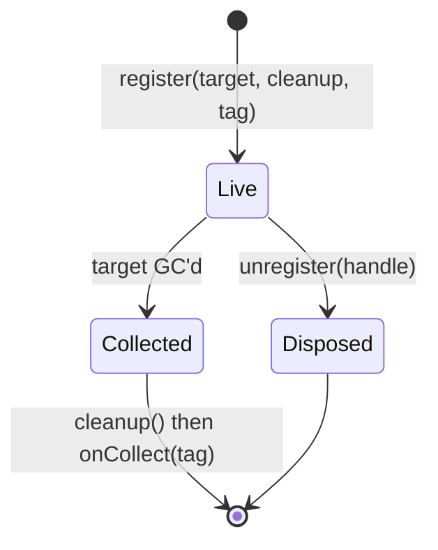

# @zakkster/lite-cleanup

[](https://www.npmjs.com/package/@zakkster/lite-cleanup)

[](https://github.com/sponsors/PeshoVurtoleta)
[](https://bundlephobia.com/result?p=@zakkster/lite-cleanup)
[](https://www.npmjs.com/package/@zakkster/lite-cleanup)
[](https://www.npmjs.com/package/@zakkster/lite-cleanup)


[](https://opensource.org/licenses/MIT)

**Zero-GC `FinalizationRegistry` helper.** Shared disposal registry with unregister semantics, tag-based collection reporting, and error routing.

Extracted from the shared FR pattern used across [`@zakkster/lite-observe`](https://github.com/PeshoVurtoleta/lite-observe) and [`@zakkster/lite-floating`](https://github.com/PeshoVurtoleta/lite-floating). Consumed as the primitive layer under [`@zakkster/lite-leak`](https://github.com/PeshoVurtoleta/lite-leak).

- Single-file ESM, no runtime deps, ASCII-only source
- One `FinalizationRegistry` per registry, tag-attributed
- Zero-GC steady state: 0 B/call on `unregister` and FR callback
- Explicit `unregister` cancels the finalizer (idempotent, null-safe)
- `onCollect` fires ONLY on the FR path -- signal that a caller missed dispose
- `onError` routes cleanup throws with tag attribution
- Node 20+; browsers with `FinalizationRegistry` support

## Install

```sh
npm i @zakkster/lite-cleanup
```

## Usage

```js
import { createDisposalRegistry } from '@zakkster/lite-cleanup';

const registry = createDisposalRegistry({
  name: 'my-module',
  onCollect: (tag) => {
    // Fires when a target was collected WITHOUT explicit unregister.
    // Use as a leak signal.
    console.warn('missed dispose:', tag);
  },
  onError: (err, tag) => {
    console.error('cleanup threw for', tag, err);
  }
});

// Register a target with a cleanup function and optional tag.
const handle = registry.register(target, cleanup, 'my-tag');

// Explicit disposal: cancels the finalizer, does NOT run cleanup.
// Caller is responsible for running cleanup manually if needed.
registry.unregister(handle);
```

## Held-value contract (LOAD-BEARING)

> **The `cleanup` closure MUST NOT close over `target`.**

Capturing the target inside the cleanup closure keeps the target reachable via the `FinalizationRegistry` itself, silently defeating finalization. The rule is un-enforceable at runtime; it is caller discipline.

**Wrong** -- target is captured in the closure:

```js
const target = someObject;
registry.register(target, () => {
  target.dispose(); // captures `target`, retains it, defeats FR
});
```

**Right** -- capture only the resources to release:

```js
const target = someObject;
const resource = target.resource;
registry.register(target, () => {
  resource.release(); // captures `resource`, not `target`
});
```

If you truly need to access the target from cleanup, wrap it in a `WeakRef` first -- but for almost every case, capturing the specific resource is what you want.

### The contract covers `tag`, not just `cleanup`

`tag` is stored on the same record, and that record **is** the `FinalizationRegistry` held value. A tag that reaches the target pins it exactly as a capturing closure does:

```js
registry.register(target, cleanup, target);          // rejected since 1.1.0
registry.register(target, cleanup, { ref: target }); // NOT detectable -- still your problem
```

The identity case throws. Deeper reachability cannot be detected without walking the object graph, so it stays caller discipline like the closure rule above.

## Lifecycle



- **Explicit path** (`unregister`): sets `disposed = true`, unregisters the FR finalizer, decrements `size()`. Does **not** invoke `cleanup`. Idempotent.
- **FR path** (target GC'd): fires `cleanup()`, then `onCollect(tag)`. Decrements `size()`. Errors in `cleanup` route to `onError`.

Only the FR path invokes `cleanup`. The explicit path is a cancellation -- the caller has already handled disposal by other means.

## API

### `VERSION: string`

Package version constant. Kept in sync with `package.json`.

### `createDisposalRegistry(options?) -> registry`

Create a new registry backed by a single `FinalizationRegistry`.

**Options:**

| Field       | Type                          | Description                                                       |
| ----------- | ----------------------------- | ----------------------------------------------------------------- |
| `name`      | `string`                      | Optional identifier for diagnostics. Defaults to `'lite-cleanup'`.|
| `onCollect` | `(tag) => void`               | Called after the FR path fires. **Not** called on `unregister`.   |
| `onError`   | `(err, tag) => void`          | Called when `cleanup` throws. If omitted, errors are swallowed.   |

**Returns** an object:

```js
registry.register(target, cleanup, tag?) -> handle
registry.unregister(handle)              -> void
registry.size()                          -> number
registry.name                            : string
```

### `registry.register(target, cleanup, tag?)`

Register `target` for finalization. When `target` becomes unreachable (and `unregister` was not called first), `cleanup` runs on the FR path.

Returns an opaque handle. Pass this handle to `unregister` to cancel.

Rejected at the boundary (since 1.1.0), because each one fails silently otherwise:

| Input | Result |
| ----- | ------ |
| `target` that is `null` or a primitive | `TypeError` naming the argument, instead of a raw `FinalizationRegistry` message |
| `tag === target` | `TypeError` -- the record is the FR held value, so a tag referencing its own target pins it forever and the finalizer can never fire |
| `cleanup` that is neither callable nor `null`/`undefined` | `TypeError` -- a string or number here is a typo, never an intent |

Objects, functions and **unregistered symbols** are all valid targets; symbols became legal FR targets in ES2023.

`cleanup` may be `null` or `undefined`, meaning *observe only, nothing to run*. `onCollect` still fires.

### `registry.unregister(handle)`

Cancel the finalizer for `handle`. Idempotent. Does **not** invoke `cleanup`.

**Handles are scoped to the registry that issued them** (since 1.1.0). Anything else -- a foreign object, another registry's handle, a primitive, `null` -- is a no-op: it is never counted, never mutated, and never throws. Before 1.1.0 any object fell through, so three foreign calls against three live handles drove `size()` to `0` while all three were still registered, and the object you passed had its `disposed`, `cleanup` and `tag` fields overwritten.

Ownership lives in a `WeakSet` of issued records, so it never pins a handle and a caller writing `handle.disposed = true` cannot defeat it.

### `registry.size()`

Count of live registrations. Consumers gate on this (`size() === 0` meaning "nothing pending"), so it fails closed: an unrecognised handle can never decrement it, and it can never report a negative count.

## Zero-GC profile

Measured via `perf_hooks` GC observation under `node --expose-gc`:

| Path            | Allocations       | Scavenges |
| --------------- | ----------------- | --------- |
| `register()`    | 1 record (~24 B)  | 0         |
| `unregister()`  | 0 B               | 0         |
| FR callback     | 0 B               | 0         |
| `size()`        | 0 B               | 0         |

`register` is not a hot path (called on subscription setup). `unregister` and the FR path are hot and stay at 0 B/call.

## Tests

```sh
npm test           # basic + no-GC-required tests
npm run test:gc    # full suite with --expose-gc
```

Ten test files:

- `basic.test.js` -- API surface and idempotency
- `held-value-contract.test.js` -- FR fires when target unreachable
- `leak-probe.test.js` -- 4096-cycle size return-to-zero
- `race.test.js` -- unregister-after-enqueue does not double-fire
- `onCollect.test.js` -- hook semantics (FR path only, tag threading)
- `error-hook.test.js` -- cleanup throws routed with tag
- `retained-heap.test.js` -- 10K cycles under 1 MB retained
- `gc-gate.test.js` -- 0 GC events on `unregister` hot path
- `version.test.js` -- `VERSION` const matches `package.json`
- `torture.test.js` -- adversarial black-box suite (24 tests): handle provenance, forged handles (lookalike, prototype-chain, frozen, hostile setter, revoked proxy, cross-realm), `register()` atomicity, retention, duplicate registration, throw containment, reentrancy, and a 100,000-operation seeded fuzz asserting `size()` is exact after every operation

The torture suite fails 17 of 24 against 1.0.0. It is black-box by design -- it only touches the public API, so it stays honest if the internals are rewritten.

## Why this exists

Two libraries in the ecosystem (`lite-observe`, `lite-floating`) inlined the same `FinalizationRegistry` bookkeeping. `@zakkster/lite-leak` needed the same pattern with additional hooks (`onCollect` for leak attribution, `onError` for cleanup error routing). Rather than triplicate the pattern, this package extracts it as the canonical primitive. Both consumers cut over in patch releases with no behavior change.

## Non-goals

- **Not a garbage collector.** FR timing is non-deterministic. This is a safety net for missed dispose, not a replacement for it.
- **Not a `WeakRef` helper.** Different concern. Use `WeakRef` directly where needed.
- **Not a resource pool.** Registrations are permanent until explicit unregister or GC.

## License

MIT (c) Zahary Shinikchiev &lt;shinikchiev@yahoo.com&gt;
